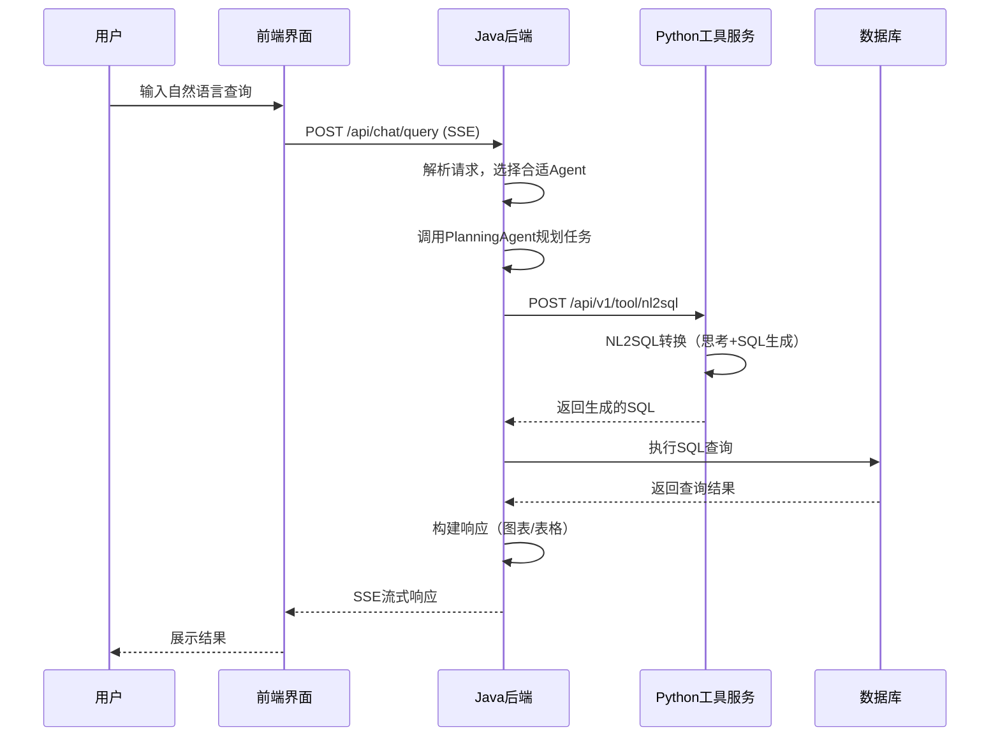
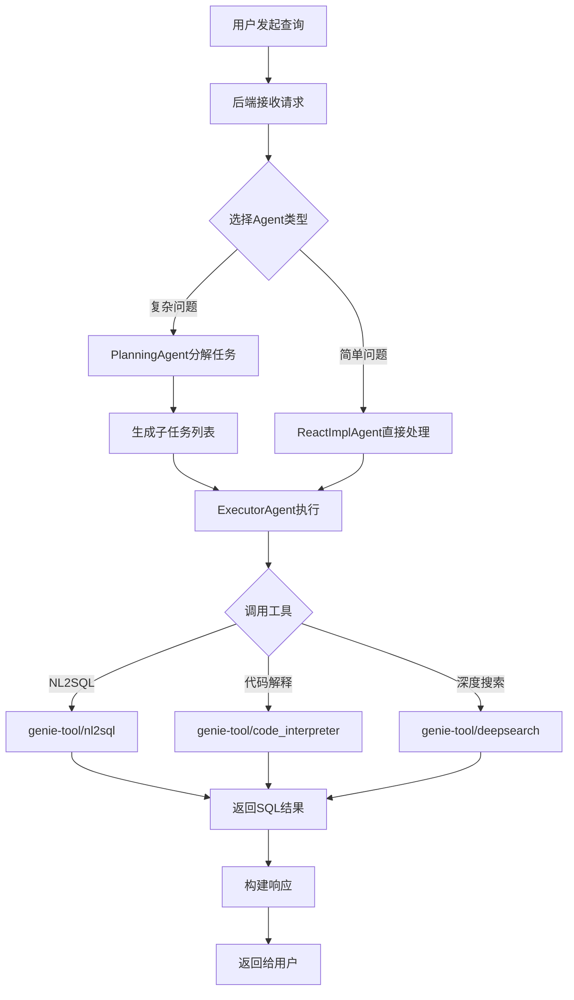

# JoyAgent-JDGenie 架构设计文档

## 1. 项目概述

JoyAgent-JDGenie 是一个基于多智能体架构的数据智能分析平台，旨在通过自然语言交互实现自动化的数据查询、分析和报告生成。该平台集成了 NL2SQL（自然语言转SQL）、代码解释器、深度搜索等多种能力，为用户提供智能化的数据服务体验。

## 2. 系统架构

### 2.1 整体架构图

```
┌─────────────────────────────────────────────────────────────────────────┐
│                         用户层 (User Layer)                              │
│  ┌───────────────────────────────────────────────────────────────────┐  │
│  │                      Web UI (React + TypeScript)                  │  │
│  └───────────────────────────────────────────────────────────────────┘  │
└───────────────────────────────┬─────────────────────────────────────────┘
                                │ HTTP/HTTPS (REST API + SSE)
                                ▼
┌─────────────────────────────────────────────────────────────────────────┐
│                        应用层 (Application Layer)                       │
│  ┌───────────────────────────────────────────────────────────────────┐  │
│  │                      Java Spring Boot Backend                      │  │
│  │  ┌─────────────┐  ┌─────────────┐  ┌───────────────────────────┐  │  │
│  │  │  Agent层    │  │  Controller │  │       Service层          │  │  │
│  │  │ Planning    │  │  DataAgent  │  │  Nl2SqlService          │  │  │
│  │  │ ReAct       │  │  Genie      │  │  TableRagService        │  │  │
│  │  │ Executor    │  │             │  │  SchemaRecallService    │  │  │
│  │  └─────────────┘  └─────────────┘  │  VectorService           │  │  │
│  │                                    │  AgentHandlerService     │  │  │
│  │                                    └───────────────────────────┘  │  │
│  └───────────────────────────────────────────────────────────────────┘  │
└───────────────────────────────┬─────────────────────────────────────────┘
                                │ HTTP API
                                ▼
┌─────────────────────────────────────────────────────────────────────────┐
│                         工具层 (Tool Layer)                             │
│  ┌───────────────────────────────────────────────────────────────────┐  │
│  │                    Python FastAPI Service                         │  │
│  │  ┌─────────────┐  ┌─────────────┐  ┌───────────────────────────┐  │  │
│  │  │   NL2SQL    │  │  DeepSearch │  │      CodeInterpreter     │  │  │
│  │  │   工具      │  │   工具      │  │        工具              │  │  │
│  │  └─────────────┘  └─────────────┘  └───────────────────────────┘  │  │
│  │  ┌─────────────┐  ┌─────────────┐  ┌───────────────────────────┐  │  │
│  │  │  TableRAG   │  │  Analysis   │  │         Report           │  │  │
│  │  │   工具      │  │   工具      │  │        工具              │  │  │
│  │  └─────────────┘  └─────────────┘  └───────────────────────────┘  │  │
│  └───────────────────────────────────────────────────────────────────┘  │
└───────────────────────────────┬─────────────────────────────────────────┘
                                │ JDBC / REST / Vector API
                                ▼
┌─────────────────────────────────────────────────────────────────────────┐
│                        数据层 (Data Layer)                              │
│  ┌─────────────┐  ┌─────────────┐  ┌─────────────┐  ┌─────────────┐   │
│  │   H2/MySQL  │  │  ClickHouse │  │   Qdrant    │  │    ES7      │   │
│  │  关系型库   │  │   数据仓库   │  │ 向量数据库  │  │ 搜索引擎   │   │
│  └─────────────┘  └─────────────┘  └─────────────┘  └─────────────┘   │
└─────────────────────────────────────────────────────────────────────────┘
```

### 2.2 模块划分

| 模块 | 技术栈 | 职责 |
|------|--------|------|
| **genie-backend** | Java 21 + Spring Boot | 核心业务逻辑、Agent调度、API网关 |
| **genie-tool** | Python 3.10 + FastAPI | NL2SQL、代码解释器、深度搜索等工具服务 |
| **genie-client** | Python | 命令行客户端 |
| **ui** | React 18 + TypeScript | Web前端界面 |

### 2.3 核心组件

#### 2.3.1 Agent 层

| Agent类型 | 职责 | 实现类 |
|-----------|------|--------|
| **PlanningAgent** | 任务规划，将复杂问题分解为子任务 | `PlanningAgent.java` |
| **ReactImplAgent** | ReAct推理框架，实现思考-行动循环 | `ReactImplAgent.java` |
| **ExecutorAgent** | 执行具体工具调用 | `ExecutorAgent.java` |
| **SummaryAgent** | 总结对话结果 | `SummaryAgent.java` |

#### 2.3.2 服务层

| 服务 | 职责 | 实现类 |
|------|------|--------|
| **Nl2SqlService** | NL2SQL工具调用与SQL执行 | `Nl2SqlService.java` |
| **TableRagService** | 表格检索增强生成 | `TableRagService.java` |
| **VectorService** | 向量检索与存储 | `VectorService.java` |
| **AgentHandlerService** | Agent响应处理 | `AgentHandlerService.java` |

## 3. 数据流

### 3.1 自然语言查询流程



### 3.2 工具调用流程



## 4. 关键技术

### 4.1 Agent 架构模式

#### ReAct 模式

ReAct（Reasoning + Acting）是一种让语言模型交替进行推理和行动的范式：

```java
// ReactImplAgent.java 核心逻辑
public class ReactImplAgent extends BaseAgent {
    // 1. 思考阶段
    private String think(String query, AgentContext context) {
        // 分析问题，决定下一步行动
        return "我需要查询数据库获取销售数据";
    }
    
    // 2. 行动阶段
    private String act(String thought, AgentContext context) {
        // 调用工具执行具体操作
        return toolService.callTool(thought, context);
    }
    
    // 3. 循环直到完成
    public AgentResponse execute(AgentRequest request) {
        while (!isFinished()) {
            String thought = think(request.getQuery(), context);
            String result = act(thought, context);
            context.addMessage(result);
        }
        return summarize();
    }
}
```

#### Planning 模式

PlanningAgent 将复杂任务分解为有序的子任务序列：

```java
// PlanningAgent.java 核心逻辑
public class PlanningAgent extends BaseAgent {
    public List<Plan> plan(String query) {
        // 1. 理解用户意图
        // 2. 分解为子任务
        // 3. 规划执行顺序
        return List.of(
            new Plan("分析问题需求", 1),
            new Plan("生成SQL查询", 2),
            new Plan("执行数据库查询", 3),
            new Plan("生成可视化图表", 4)
        );
    }
}
```

### 4.2 NL2SQL 转换流程

NL2SQL工具实现了自然语言到SQL的转换：

```python
# genie_tool/tool/nl2sql.py
class NL2SQLTool:
    async def run(self, request):
        # 1. 查询重写（Rewrite）
        rewritten_query = await self._text_to_rewrite(request.query)
        
        # 2. 列筛选（Column Filter）
        rank_result = await self._column_filter(request)
        
        # 3. 思考过程（Think）
        thinking_result = await self._think(request, rank_result)
        
        # 4. SQL生成（SQL Generate）
        sql = await self._nl2sql_convert(rewritten_query, thinking_result)
        
        # 5. SQL修复（可选）
        fixed_sql = await self._fix_sql_with_llm(sql, request.query)
        
        return fixed_sql
```

### 4.3 SSE 流式响应

后端使用 Server-Sent Events 实现实时响应：

```java
// SseEmitterUTF8.java
public class SseEmitterUTF8 extends SseEmitter {
    public void sendEvent(String eventType, Object data) {
        try {
            EventMessage message = new EventMessage(eventType, data);
            send(SseEmitter.event()
                .name("message")
                .data(message, MediaType.APPLICATION_JSON));
        } catch (IOException e) {
            // 处理异常
        }
    }
}
```

## 5. 部署架构

### 5.1 Docker 部署

项目支持 Docker 一键部署，包含以下容器：

| 服务 | 端口 | 说明 |
|------|------|------|
| **前端** | 3000 | React Web应用 |
| **后端** | 8080 | Spring Boot API |
| **工具服务** | 1601 | Python FastAPI |

### 5.2 配置管理

配置文件位于 `genie-backend/src/main/resources/application.yml`：

```yaml
server:
  port: 8080

spring:
  datasource:
    url: jdbc:h2:mem:example_db
    driver-class-name: org.h2.Driver
    username: sa

genie:
  llm:
    default:
      model: deepseek/deepseek-chat
      api-key: ${OPENAI_API_KEY}
      base-url: ${OPENAI_API_BASE}
  datasource:
    dialect: h2
```

## 6. 安全设计

### 6.1 API 安全

- **CORS 配置**：限制允许的来源域名
- **请求限流**：防止恶意请求攻击
- **SQL 注入防护**：参数化查询和SQL解析校验

### 6.2 数据安全

- **敏感信息检测**：自动检测并脱敏敏感数据
- **数据加密**：传输层使用 HTTPS
- **访问控制**：基于角色的权限管理

---

## 附录：文件结构速查

| 目录 | 说明 |
|------|------|
| `genie-backend/src/main/java/com/jd/genie/agent/` | Agent实现 |
| `genie-backend/src/main/java/com/jd/genie/service/` | 业务服务 |
| `genie-backend/src/main/java/com/jd/genie/data/` | 数据层 |
| `genie-tool/genie_tool/tool/` | 工具实现 |
| `ui/src/components/` | 前端组件 |
| `ui/src/services/` | 前端API调用 |
