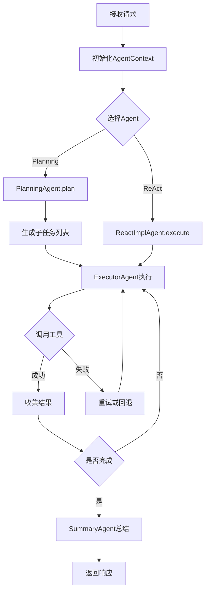
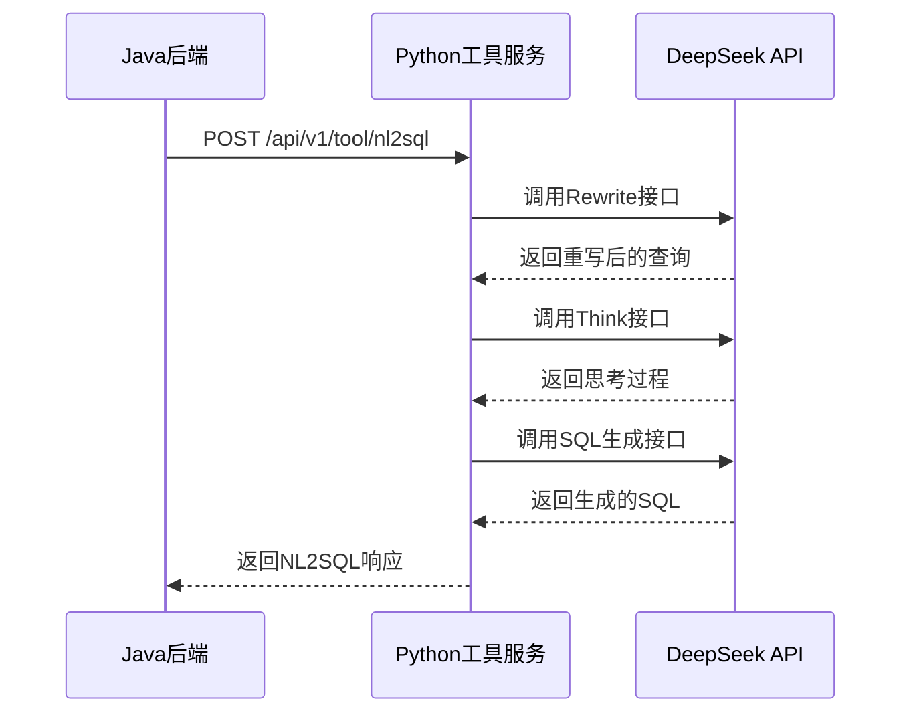

# JoyAgent-JDGenie 后端技术文档

## 1. 概述

`genie-backend` 是 JoyAgent-JDGenie 项目的核心后端服务，基于 Java 21 + Spring Boot 3.2.x 构建，负责处理用户请求、调度 Agent 执行、调用工具服务、管理数据查询等核心业务逻辑。

## 2. 技术栈

| 分类 | 技术 | 版本 |
|------|------|------|
| 语言 | Java | 21 |
| 框架 | Spring Boot | 3.2.x |
| 数据库 | H2 (默认) / MySQL / ClickHouse | - |
| 向量数据库 | Qdrant | - |
| 搜索引擎 | Elasticsearch | 7.x |
| ORM | MyBatis Plus | 3.5.x |
| HTTP客户端 | OkHttp | 4.12.x |
| JSON处理 | Jackson | 2.16.x |

## 3. 项目结构

```
genie-backend/
├── src/main/java/com/jd/genie/
│   ├── agent/              # Agent层
│   │   ├── agent/          # Agent实现
│   │   ├── dto/            # Agent数据传输对象
│   │   ├── enums/          # Agent枚举
│   │   ├── llm/            # LLM配置与调用
│   │   ├── printer/        # 输出打印器
│   │   ├── prompt/         # Prompt模板
│   │   ├── tool/           # 工具调用抽象
│   │   └── util/           # Agent工具类
│   ├── config/             # 配置类
│   ├── controller/         # REST API控制层
│   ├── data/               # 数据访问层
│   │   ├── dto/            # 数据传输对象
│   │   ├── model/          # 数据模型
│   │   ├── provider/       # 数据提供者
│   │   └── sql/            # SQL解析工具
│   ├── entity/             # 数据库实体
│   ├── handler/            # 响应处理器
│   ├── mapper/             # MyBatis Mapper
│   ├── model/              # 业务模型
│   ├── service/            # 业务服务层
│   │   └── impl/           # 服务实现
│   └── util/               # 通用工具类
├── src/main/resources/
│   ├── db/                 # 数据库初始化脚本
│   └── application.yml     # 应用配置
└── pom.xml                 # Maven依赖管理
```

## 4. 核心模块详解

### 4.1 Agent 层

#### 4.1.1 Agent 类型

| Agent类 | 职责 | 适用场景 |
|---------|------|----------|
| `PlanningAgent` | 任务规划，分解复杂问题 | 多步骤任务、报告生成 |
| `ReactImplAgent` | ReAct推理框架 | 单步查询、简单对话 |
| `ExecutorAgent` | 执行具体工具调用 | 执行子任务 |
| `SummaryAgent` | 总结对话结果 | 任务结束时总结 |

#### 4.1.2 Agent 执行流程



#### 4.1.3 AgentContext

`AgentContext` 是 Agent 执行过程中的上下文对象，存储会话状态、历史消息、工具调用记录等：

```java
public class AgentContext {
    private String sessionId;           // 会话ID
    private List<Message> messages;     // 消息历史
    private Map<String, Object> state;  // 状态存储
    private Plan currentPlan;           // 当前执行计划
    private int stepCount;              // 执行步数
    
    // 添加消息
    public void addMessage(Message message) { ... }
    
    // 获取历史消息
    public List<Message> getHistory(int limit) { ... }
    
    // 设置状态
    public void setState(String key, Object value) { ... }
}
```

### 4.2 控制器层

#### 4.2.1 主要控制器

| 控制器 | 职责 | 路径 |
|--------|------|------|
| `GenieController` | 核心查询接口 | `/api/chat/query` |
| `DataAgentController` | 数据代理接口 | `/api/data/*` |

#### 4.2.2 核心 API

**POST /api/chat/query** - 发起对话查询

请求体：
```json
{
  "query": "给我最近几年的销售额趋势图",
  "sessionId": "abc123",
  "agentType": "PLANNING",
  "modelCodeList": ["t_qtpbgamccmrctthlurauclckq"],
  "parameters": {}
}
```

响应（SSE流式）：
```json
{
  "eventType": "THINK",
  "data": "分析问题需求..."
}
{
  "eventType": "TOOL_CALL",
  "data": {"toolName": "nl2sql", "params": {...}}
}
{
  "eventType": "CHART_DATA",
  "data": {...}
}
{
  "eventType": "READY",
  "data": ""
}
```

### 4.3 服务层

#### 4.3.1 Nl2SqlService

负责 NL2SQL 工具调用和 SQL 执行：

```java
@Service
public class Nl2SqlService {
    
    /**
     * 调用NL2SQL工具生成SQL
     */
    public NL2SQLResult generateSql(NL2SQLReq request) {
        // 调用Python工具服务
        // 返回生成的SQL
    }
    
    /**
     * 执行SQL查询
     */
    public QueryResult executeSql(String sql, String dialect) {
        // 根据方言选择执行器
        // 返回查询结果
    }
}
```

#### 4.3.2 AgentHandlerService

负责 Agent 响应处理和 SSE 推送：

```java
@Service
public interface AgentHandlerService {
    
    /**
     * 处理Agent响应
     */
    void handleResponse(AgentResponse response, SseEmitterUTF8 emitter);
    
    /**
     * 发送THINK事件
     */
    void sendThinkEvent(SseEmitterUTF8 emitter, String content);
    
    /**
     * 发送图表数据
     */
    void sendChartData(SseEmitterUTF8 emitter, ChartData data);
}
```

#### 4.3.3 VectorService

负责向量检索和存储：

```java
@Service
public class VectorService {
    
    /**
     * 存储向量数据
     */
    public void save(VectorSaveReq request) { ... }
    
    /**
     * 向量检索
     */
    public List<VectorRecallResult> recall(VectorRecallReq request) { ... }
}
```

### 4.4 数据层

#### 4.4.1 SQL 解析

`SqlParserUtils` 负责解析和验证 SQL 语句：

```java
public class SqlParserUtils {
    
    /**
     * 解析SELECT语句
     */
    public static SqlModel parseSelectSql(String sql, String dialect) {
        // 使用Calcite解析SQL
        // 验证语法正确性
        // 返回SQL模型
    }
    
    /**
     * 验证SQL是否为SELECT语句
     */
    public static boolean isSelectSql(String sql, String dialect) { ... }
}
```

#### 4.4.2 数据提供者

`DataProvider` 接口定义数据查询能力：

```java
public interface DataProvider {
    
    /**
     * 查询数据
     */
    QueryResult query(DataQueryRequest request);
    
    /**
     * 获取表元数据
     */
    List<TableColumn> getTableColumns(String tableId);
    
    /**
     * 获取表列表
     */
    List<SimpleTable> getTableList();
}
```

## 5. 工具调用机制

### 5.1 工具服务调用

后端通过 HTTP 调用 Python 工具服务：

```java
@Service
public class ToolService {
    
    private final OkHttpClient client;
    
    /**
     * 调用NL2SQL工具
     */
    public NL2SQLResponse callNl2Sql(NL2SQLReq request) {
        String url = "http://localhost:1601/api/v1/tool/nl2sql";
        String json = objectMapper.writeValueAsString(request);
        
        RequestBody body = RequestBody.create(json, MediaType.parse("application/json"));
        Request request = new Request.Builder()
            .url(url)
            .post(body)
            .build();
        
        try (Response response = client.newCall(request).execute()) {
            return objectMapper.readValue(response.body().string(), NL2SQLResponse.class);
        }
    }
}
```

### 5.2 工具调用流程



## 6. 配置说明

### 6.1 application.yml 关键配置

```yaml
server:
  port: 8080

spring:
  datasource:
    url: jdbc:h2:mem:example_db;DB_CLOSE_DELAY=-1
    driver-class-name: org.h2.Driver
    username: sa
    password: 

genie:
  llm:
    default:
      model: deepseek/deepseek-chat
      api-key: ${OPENAI_API_KEY}
      base-url: ${OPENAI_API_BASE}
      temperature: 0.1
      top-p: 0.9
  datasource:
    dialect: h2
    default-model-code: t_qtpbgamccmrctthlurauclckq
  agent:
    max-steps: 10
    timeout-minutes: 30
  tool:
    url: http://localhost:1601/api/v1/tool

# 可选配置
es-config:
  enable: false
  host: localhost
  port: 9200

qdrantConfig:
  enable: false
  host: localhost
  port: 6333
```

### 6.2 环境变量

| 变量名 | 说明 | 默认值 |
|--------|------|--------|
| `OPENAI_API_KEY` | DeepSeek API密钥 | - |
| `OPENAI_API_BASE` | DeepSeek API地址 | https://api.deepseek.com |
| `TOOL_SERVICE_URL` | 工具服务地址 | http://localhost:1601 |

## 7. 错误处理

### 7.1 异常类型

| 异常类 | 说明 | HTTP状态码 |
|--------|------|------------|
| `JdbcBizException` | 数据库操作异常 | 500 |
| `CatalogException` | 数据目录异常 | 400 |
| `TokenLimitExceeded` | Token超限异常 | 429 |

### 7.2 错误响应格式

```json
{
  "code": 500,
  "message": "SQL执行失败",
  "detail": "请检查SQL是否正确",
  "timestamp": "2024-01-01T12:00:00"
}
```

## 8. 部署与运行

### 8.1 开发环境

```bash
# 进入目录
cd genie-backend

# 编译
mvn clean package -DskipTests

# 运行
java -jar target/genie-backend-0.0.1-SNAPSHOT.jar
```

### 8.2 生产环境

```bash
# 使用Docker
docker build -t genie-backend .
docker run -d -p 8080:8080 genie-backend

# 或使用启动脚本
./start.sh
```

## 附录：核心类路径速查

| 类 | 路径 |
|----|------|
| `PlanningAgent` | `agent/agent/PlanningAgent.java` |
| `ReactImplAgent` | `agent/agent/ReactImplAgent.java` |
| `Nl2SqlService` | `service/Nl2SqlService.java` |
| `AgentHandlerService` | `service/AgentHandlerService.java` |
| `GenieController` | `controller/GenieController.java` |
| `SqlParserUtils` | `data/sql/SqlParserUtils.java` |
| `SseEmitterUTF8` | `util/SseEmitterUTF8.java` |
